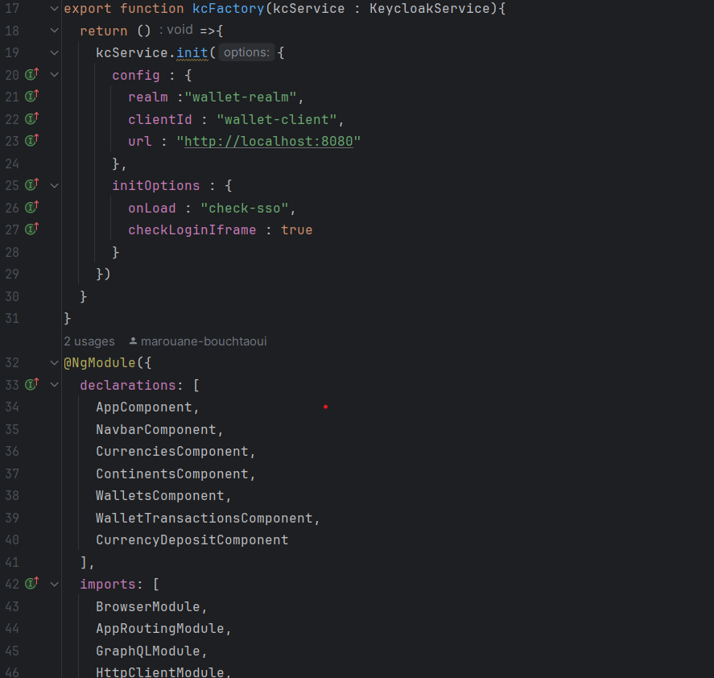
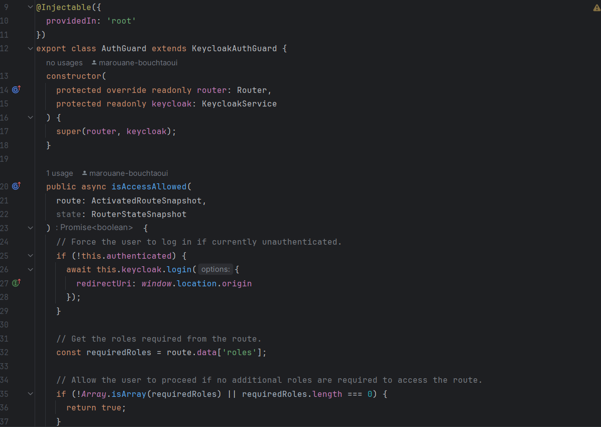
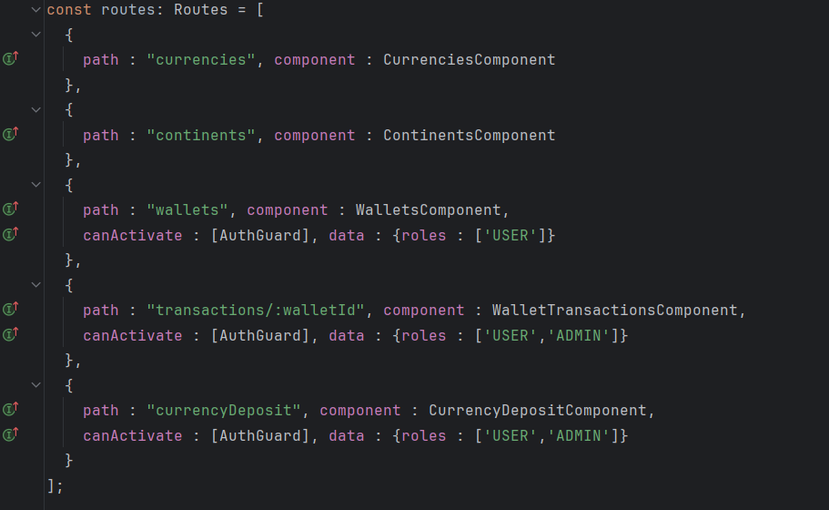
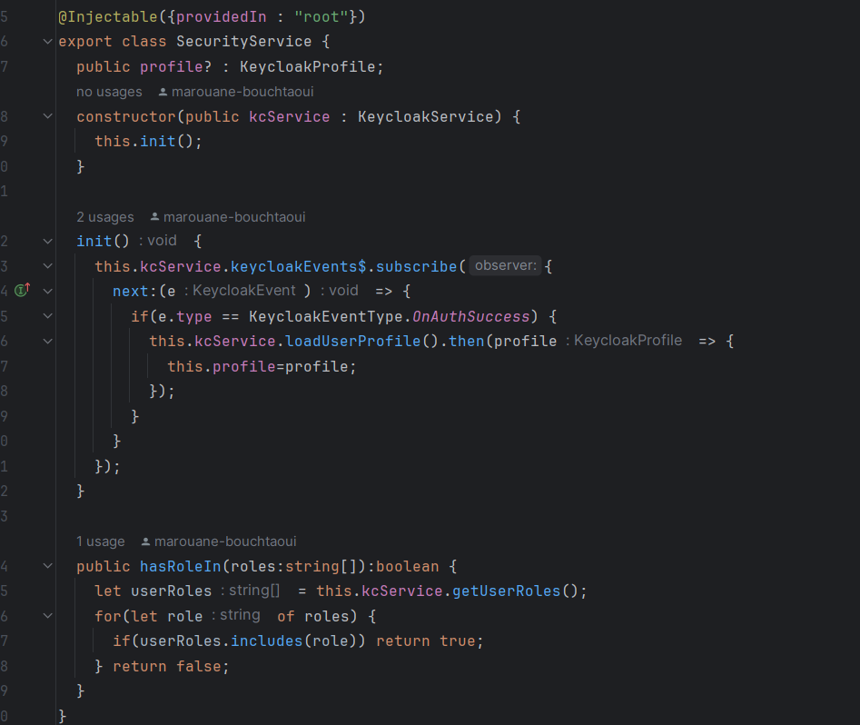
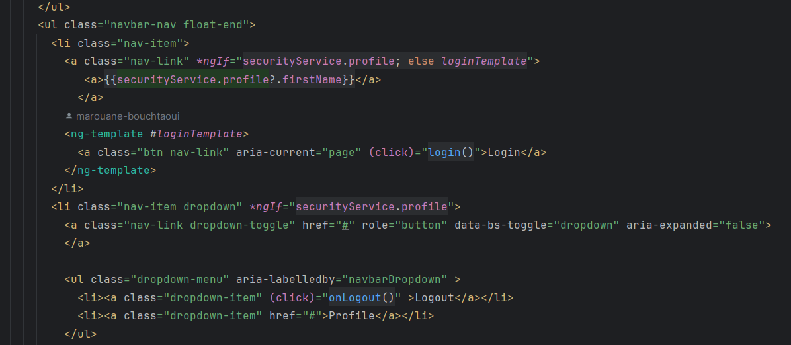
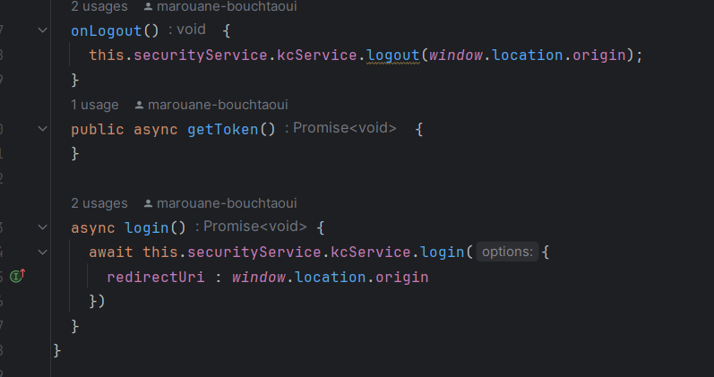
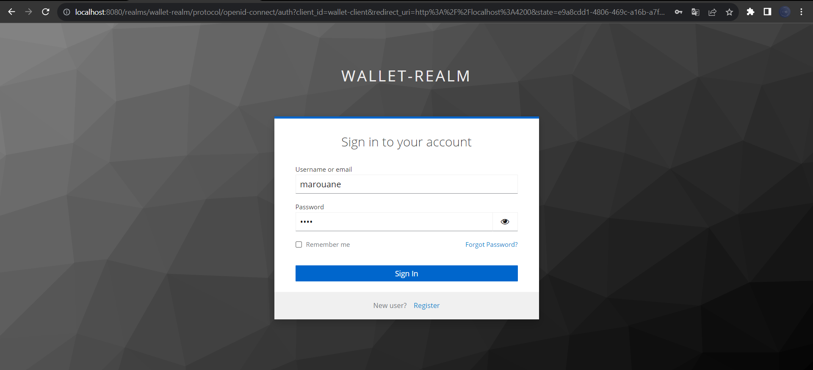
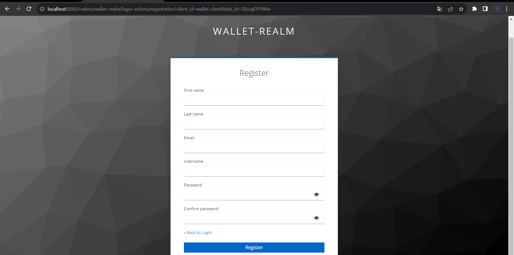
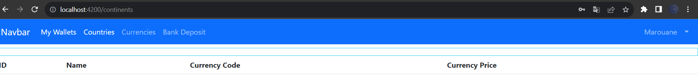

# Ebanking Frontend

<br>

Vous pouvez voir le backend et la configuration du Keycloak <br>
LINK: (https://github.com/marouane-bouchtaoui/ebanking-secured-keycloak-backend)

<hr>
Pour la configuration du front-end on doit  ajouter la dependence suivante : <br>

```
npm install --save keycloak-js keycloak-angular
```
<br>
Apres on ajoute la fonction kcFactory dans la classe app.module.ts et KeycloakAngularModule dans "imports" : <br>



puis la création d'un guard classe dans le dossier guard : <br>



et pour les routes: <br>



La configurer la classe security.service.ts :<br>



L'affichage du navbar sera comme le suivant :<br>



L'implementation des methodes Login et Logout :<br>



## Resultat

<br>
Pour s'authentifier :
<br>



<br>

Pour s'enregistrer :
<br>



<br>


La page d'accueil :
<br>


